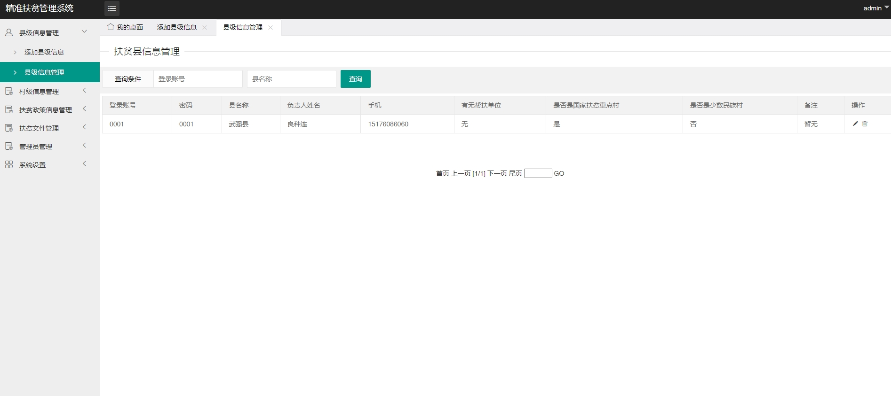
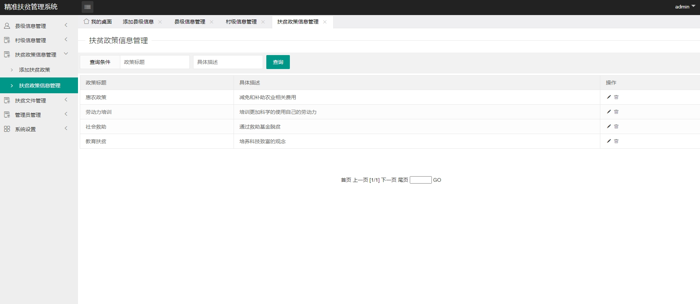
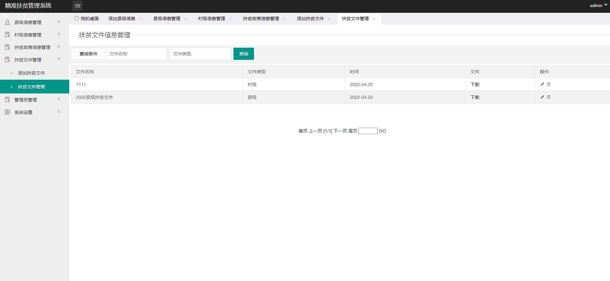

# 1.项目介绍
- 功能模块：县级模块、村级模块、贫困户管理、脱贫管理、政策文件管理等
- 技术栈：SSM，JSP
- 测试环境：idea2024，tomcat8.5，navicat
# 2.项目部署
- 创建数据库，导入sql
- 通过idea打开项目fupin
- 根据本地数据库环境，修改src/jdbc.properties  1-4行
- 配置tocamt
- 启动项目：本机ip:8080/fupin_war_exploded/ 其中fupin_war_exploded可以自己配置
# 3.项目部分截图

# 4.获取方式
[戳我查看](https://gitee.com/aven999/mall)